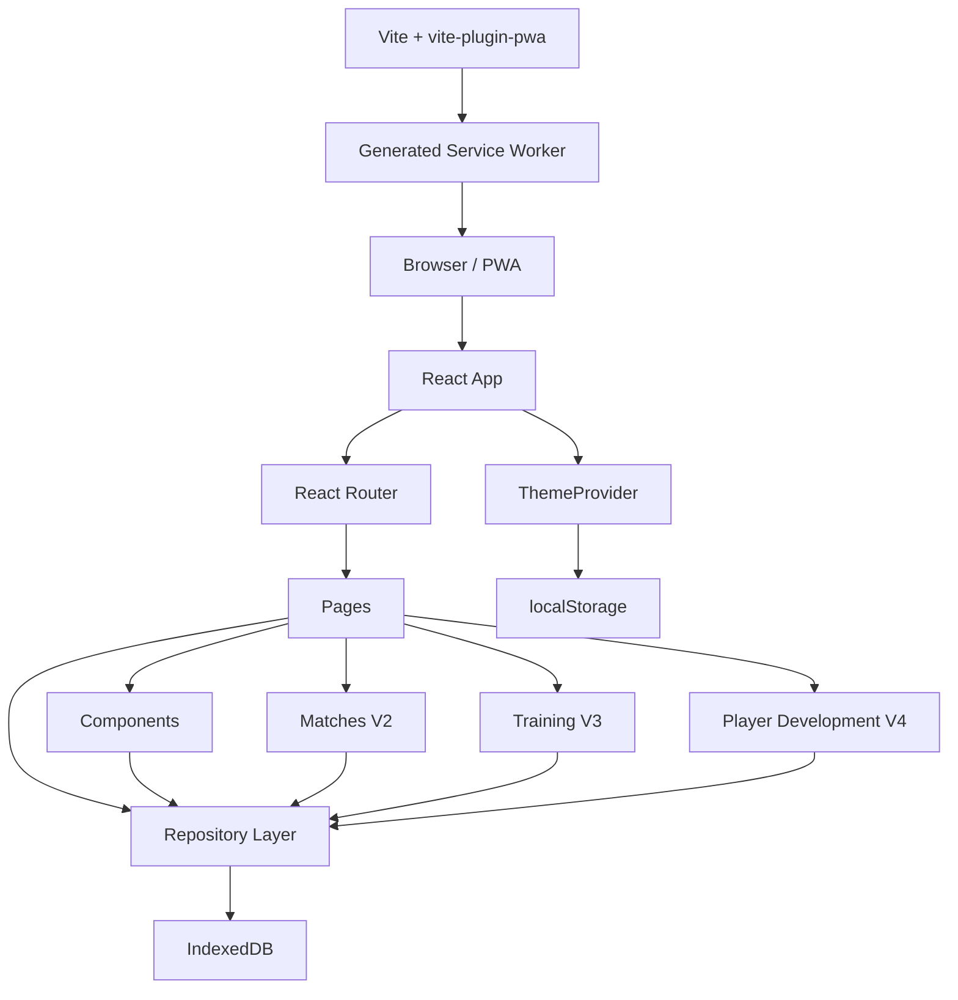

# Architecture

## Overview

Coach Field e una SPA React con persistenza locale. La struttura e volutamente semplice: pagine React, componenti riusabili, repository IndexedDB e seed statici.

## Entry Points

- `index.html`: HTML shell, meta PWA e script iniziale per applicare il tema salvato.
- `src/main.tsx`: importa CSS temi/globali, monta React e avvolge l'app in `ThemeProvider`.
- `src/App.tsx`: inizializza IndexedDB con `initializeDatabase()` e configura il routing.

## Routing

Le route sono definite in `src/App.tsx`:

- `/`: TodayPage
- `/players`: PlayersPage
- `/players/:id`: PlayerDetailPage
- `/matches`: MatchesPage
- `/matches/:id`: MatchDetailPage
- `/goalkeepers`: GoalkeepersPage
- `/notes`: NotesPage
- `/training`: TrainingPage
- `/training/:id`: TrainingSessionDetailPage

Tutte le route usano `Layout`, che include outlet centrale, bottone tema e BottomNav.

## Pages

- `TodayPage`: seduta corrente, timer, fasi, presenze, adattamenti, esercizi e note vocali.
- `PlayersPage`: rosa, ricerca, filtri, ordinamento, rating sintetico e aggiunta giocatore.
- `PlayerDetailPage`: profilo giocatore con Panoramica, Timeline, Obiettivi e Storico; rating generale manuale, ruoli ideali, storico partite/allenamenti, osservazioni, note e promozione ospite.
- `MatchesPage`: elenco partite prossime/passate, filtri per tipo e creazione partita.
- `MatchDetailPage`: dettaglio partita, risultato, valutazione squadra, partecipanti, valutazioni individuali e completamento.
- `TrainingPage`: sessioni prossime/passate, template allenamento, creazione da zero e da template.
- `TrainingSessionDetailPage`: presenze, programma sessione, valutazione fasi, valutazioni giocatori, note e takeaways.
- `GoalkeepersPage`: gestione candidati portiere e osservazioni specifiche.
- `NotesPage`: archivio note vocali/testuali, filtri, export e restore.

## Components

- `Layout`: shell applicativa e navigazione.
- `ExerciseDetailModal`: bottom sheet per dettaglio esercizio.
- `AttendanceSheet`: gestione presenze.
- `AddPlayerModal`: aggiunta rapida ospite.
- `AdaptationSheet`: dettaglio adattamento ai presenti.
- `ThemeSelectorSheet`: selettore temi.
- `CreateMatchModal`: creazione rapida partita.
- `MatchPlayerEvaluationSheet`: valutazione individuale dentro una partita.
- `TrainingPhaseSheet`: dettaglio e valutazione reale di una fase sessione.
- `TrainingPlayerEvaluationSheet`: valutazione individuale dentro un allenamento.
- `PlayerObjectiveSheet`: creazione obiettivo di sviluppo individuale, anche da contesto partita/allenamento.
- `PlayerObjectivesQuickCheck`: check rapido di obiettivi attivi con evidenza positiva, mista o attenzione.
- `PlayerReviewSheet`: review periodica come snapshot qualitativo.
- `VoiceRecorder`: registrazione audio via MediaRecorder.
- `AudioNote`: playback e cancellazione nota vocale.
- `PlayerStarRating`: rating visuale a mezze stelle.
- `LoadingScreen`: stato di caricamento iniziale.

## Data Access

La UI non usa direttamente IndexedDB. Ogni store ha un repository:

- `playersRepository.ts`
- `attendanceRepository.ts`
- `observationsRepository.ts`
- `voiceNotesRepository.ts`
- `sessionsRepository.ts`
- `appStateRepository.ts`
- `matchesRepository.ts`
- `matchPlayerEvaluationsRepository.ts`
- `trainingTemplatesRepository.ts`
- `trainingPlayerEvaluationsRepository.ts`
- `playerDevelopmentRepository.ts`
- `backupRepository.ts`

`db.ts` definisce schema, upgrade IndexedDB, seed iniziale e migrazioni.

## State Management

Non e presente uno state manager globale. Lo stato e gestito con React hooks locali:

- stato pagina con `useState`
- caricamento iniziale con `useEffect`
- derivazioni con `useMemo`
- tema con Context React

Questa scelta mantiene l'MVP semplice, ma richiede refresh manuali dopo alcune scritture repository.

## Build And Config

- `vite.config.ts`: React plugin + PWA plugin.
- `eslint.config.js`: ESLint flat config con TypeScript, hooks e React Refresh.
- `tsconfig.app.json`: TypeScript target ES2023, strictness operativa tramite noUnused e noFallthrough.

## Deployment

Il progetto e configurato come app statica Vite. Non e presente configurazione Vercel dedicata nel repository.
