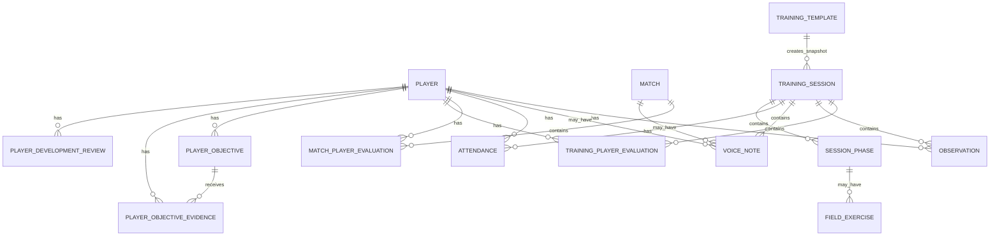

# Data Model

## IndexedDB

Database: `coach-field-db`

Versione IndexedDB attuale: `5`

Store:

- `players`
- `sessions`
- `observations`
- `voiceNotes`
- `appState`
- `attendance`
- `matches`
- `matchPlayerEvaluations`
- `trainingTemplates`
- `trainingPlayerEvaluations`
- `playerObjectives`
- `playerObjectiveEvidence`
- `playerDevelopmentReviews`



## Player

```ts
type Player = {
  id: string
  firstName: string
  lastName: string
  year: 2016 | 2017 | 'other'
  previousRoles: string[]
  rating: PlayerRating
  idealRoles: PlayerRole[]
  goalkeeperCandidate: boolean
  status?: 'roster' | 'guest'
}
```

`status` distingue giocatori della rosa e ospiti aggiunti al volo. I giocatori seedati sono `roster`; i giocatori creati dal modale sono `guest` finche non vengono promossi dal profilo.

## PlayerRating

Valori supportati:

- `null`
- `0.5`
- `1`
- `1.5`
- `2`
- `2.5`
- `3`
- `3.5`
- `4`
- `4.5`
- `5`

## PlayerRole

```ts
type PlayerRole = 'POR' | 'DIF' | 'CEN' | 'ATT' | 'JOLLY'
```

I ruoli ideali usano codici brevi. I ruoli storici (`previousRoles`) sono stringhe descrittive, per esempio `Portiere`, `Difensore`, `Centrocampista`.

## Observation

```ts
type Observation = {
  id: string
  playerId: string
  sessionId: string
  phaseId?: string
  category: ObservationCategory
  value: 'positive' | 'attention'
  note?: string
  createdAt: string
}
```

Categorie:

- `technique`
- `game`
- `attitude`
- `relationship`
- `goalkeeper`

## VoiceNote

```ts
type VoiceNote = {
  id: string
  playerId?: string
  sessionId: string
  phaseId?: string
  exerciseId?: string
  matchId?: string
  createdAt: string
  durationSeconds: number
  mimeType: string
  audio: Blob
}
```

Le note vocali salvano il blob audio direttamente in IndexedDB. Il nuovo export dati serializza il blob come Data URL base64 mantenendo mime type, durata e collegamenti a giocatore/seduta/fase/esercizio/partita.

## Match

```ts
type Match = {
  id: string
  date: string
  opponent: string
  competition?: string
  matchType: 'league' | 'tournament' | 'friendly' | 'other'
  homeAway: 'home' | 'away' | 'neutral'
  location?: string
  goalsFor?: number
  goalsAgainst?: number
  teamRating?: PlayerRating
  teamNotes?: string
  trainingTakeaways?: string
  status: 'planned' | 'completed'
  createdAt: string
  updatedAt: string
}
```

`matches` contiene le partite pianificate o completate. Gli indici principali sono `by-date`, `by-status` e `by-type`.

## MatchPlayerEvaluation

```ts
type MatchPlayerEvaluation = {
  id: string
  matchId: string
  playerId: string
  selected: boolean
  present: boolean
  starter?: boolean
  rolesPlayed: PlayerRole[]
  rating: PlayerRating
  note?: string
  positiveTags?: string[]
  attentionTags?: string[]
  createdAt: string
  updatedAt: string
}
```

Le valutazioni partita sono separate dal profilo giocatore. La media partita nel profilo usa questi record, mentre `Player.rating` resta una valutazione generale manuale.

Indici:

- `by-match`
- `by-player`
- `by-match-player`

## TrainingSession

```ts
type TrainingSession = {
  id: string
  title: string
  durationMinutes: number
  phases: SessionPhase[]
}
```

La seduta corrente e seedata in `src/data/sessionSeed.ts`.

In V3 `TrainingSession` e anche lo storico di allenamenti reali. Mantiene compatibilita con il vecchio campo `phases`, ma puo contenere anche:

```ts
type TrainingSessionStatus = 'planned' | 'in_progress' | 'completed'

type TrainingSession = {
  id: string
  date?: string
  startTime?: string
  title: string
  templateId?: string
  durationMinutes: number
  status?: TrainingSessionStatus
  phases: SessionPhase[]
  plannedPhases?: TrainingSessionPhase[]
  generalNotes?: string
  takeaways?: string
  createdAt?: string
  updatedAt?: string
}
```

`plannedPhases` e una snapshot. Se un template viene modificato dopo la creazione della sessione, la sessione storica non cambia.

## TrainingTemplate

```ts
type TrainingTemplate = {
  id: string
  title: string
  description?: string
  ageGroup?: string
  expectedDurationMinutes: number
  minPlayers?: number
  maxPlayers?: number
  tags: string[]
  phases: TrainingTemplatePhase[]
  createdAt: string
  updatedAt: string
}
```

## TrainingSessionPhase

```ts
type TrainingSessionPhase = {
  id: string
  title: string
  order: number
  plannedDurationMinutes?: number
  actualDurationMinutes?: number
  exerciseId?: string
  exerciseSnapshot?: TrainingExerciseSnapshot
  status: 'planned' | 'completed' | 'skipped' | 'modified'
  coachRating?: PlayerRating
  coachNotes?: string
  variationUsed?: string
}
```

## TrainingPlayerEvaluation

```ts
type TrainingPlayerEvaluation = {
  id: string
  sessionId: string
  playerId: string
  rating: PlayerRating
  rolesTried: PlayerRole[]
  note?: string
  positiveTags?: string[]
  attentionTags?: string[]
  createdAt: string
  updatedAt: string
}
```

La media allenamenti nel profilo e calcolata dinamicamente da questo store e non viene salvata dentro `Player`.

## PlayerObjective

```ts
type PlayerObjective = {
  id: string
  playerId: string
  title: string
  description?: string
  category: 'technical' | 'tactical' | 'physical' | 'mental' | 'relational' | 'goalkeeper' | 'other'
  priority: 'low' | 'medium' | 'high'
  status: 'active' | 'achieved' | 'paused' | 'archived'
  createdAt: string
  updatedAt: string
  achievedAt?: string
  sourceMatchId?: string
  sourceTrainingSessionId?: string
  notes?: string
}
```

Gli obiettivi sono qualitativi e osservabili. Non generano classifiche, ranking o punteggi globali.

## PlayerObjectiveEvidence

```ts
type PlayerObjectiveEvidence = {
  id: string
  objectiveId: string
  playerId: string
  date: string
  outcome: 'positive' | 'mixed' | 'attention'
  note?: string
  matchId?: string
  trainingSessionId?: string
  createdAt: string
}
```

Le evidenze possono nascere dal profilo, dalla scheda valutazione partita o dalla scheda valutazione allenamento. Servono a tracciare segnali puntuali su un obiettivo, non a calcolare un voto automatico.

## PlayerDevelopmentReview

```ts
type PlayerDevelopmentReview = {
  id: string
  playerId: string
  date: string
  overallRatingSnapshot?: PlayerRating
  strengths: string[]
  developmentAreas: string[]
  suggestedRoles: PlayerRole[]
  summary?: string
  createdAt: string
  updatedAt: string
}
```

La review e uno snapshot periodico. Conserva lo stato valutativo e i ruoli suggeriti in quel momento, anche se il profilo viene modificato in futuro.

## SessionPhase

Ogni fase contiene orari, testo operativo e opzionalmente campi/esercizi:

```ts
type SessionPhase = {
  id: string
  title: string
  startMinute: number
  endMinute: number
  description?: string[]
  sequence?: string[]
  objective?: string
  observe?: string[]
  fields?: FieldExercise[]
  sections?: Array<{ title: string; items: string[] }>
  questions?: string[]
}
```

## FieldExercise

Contiene formato, focus, regola speciale, setup, istruzioni e osservazioni per un esercizio su campo.

## AppState

```ts
type AppState = {
  id: 'current'
  sessionId: string
  currentPhaseId: string
  timer: TimerState
}
```

`appState` contiene anche la versione seed giocatori:

```ts
{
  id: 'playerSeedVersion',
  key: 'playerSeedVersion',
  value: number
}
```

## Attendance

```ts
type Attendance = {
  id: string
  sessionId: string
  playerId: string
  present: boolean
}
```

L'id e composto come `sessionId:playerId`.

## Seed Versioning

La costante `PLAYER_SEED_VERSION` vive in `src/data/playersSeed.ts`. La migrazione V2 partite vive nello schema IndexedDB versione `3`; la V3 allenamenti/template vive nella versione `4`; la V4 player development aggiunge store additivi nello schema versione `5`.

All'avvio `initializeDatabase()` legge `appState.playerSeedVersion`; se manca o e inferiore alla versione corrente, esegue la migrazione dei giocatori. La migrazione rimuove vecchi placeholder, preserva sessioni, voice notes e dati non correlati, e aggiorna la versione solo al termine delle scritture.
