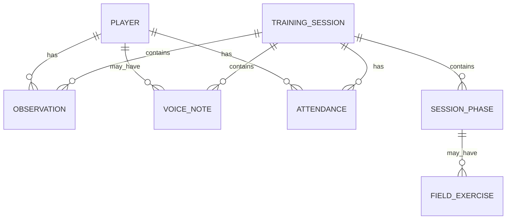

# Data Model

## IndexedDB

Database: `coach-field-db`

Versione IndexedDB attuale: `2`

Store:

- `players`
- `sessions`
- `observations`
- `voiceNotes`
- `appState`
- `attendance`



## Player

```ts
type Player = {
  id: string
  firstName: string
  lastName: string
  year: 2016 | 2017 | 'other'
  previousRoles: string[]
  rating: PlayerRating
  idealRoles: PlayerRole[]
  goalkeeperCandidate: boolean
  status?: 'roster' | 'guest'
}
```

`status` distingue giocatori della rosa e ospiti aggiunti al volo. I giocatori seedati sono `roster`; i giocatori creati dal modale sono `guest` finche non vengono promossi dal profilo.

## PlayerRating

Valori supportati:

- `null`
- `0.5`
- `1`
- `1.5`
- `2`
- `2.5`
- `3`
- `3.5`
- `4`
- `4.5`
- `5`

## PlayerRole

```ts
type PlayerRole = 'POR' | 'DIF' | 'CEN' | 'ATT' | 'JOLLY'
```

I ruoli ideali usano codici brevi. I ruoli storici (`previousRoles`) sono stringhe descrittive, per esempio `Portiere`, `Difensore`, `Centrocampista`.

## Observation

```ts
type Observation = {
  id: string
  playerId: string
  sessionId: string
  phaseId?: string
  category: ObservationCategory
  value: 'positive' | 'attention'
  note?: string
  createdAt: string
}
```

Categorie:

- `technique`
- `game`
- `attitude`
- `relationship`
- `goalkeeper`

## VoiceNote

```ts
type VoiceNote = {
  id: string
  playerId?: string
  sessionId: string
  phaseId?: string
  exerciseId?: string
  createdAt: string
  durationSeconds: number
  mimeType: string
  audio: Blob
}
```

Le note vocali salvano il blob audio direttamente in IndexedDB. Il nuovo export dati serializza il blob come Data URL base64 mantenendo mime type, durata e collegamenti a giocatore/seduta/fase/esercizio.

## TrainingSession

```ts
type TrainingSession = {
  id: string
  title: string
  durationMinutes: number
  phases: SessionPhase[]
}
```

La seduta corrente e seedata in `src/data/sessionSeed.ts`.

## SessionPhase

Ogni fase contiene orari, testo operativo e opzionalmente campi/esercizi:

```ts
type SessionPhase = {
  id: string
  title: string
  startMinute: number
  endMinute: number
  description?: string[]
  sequence?: string[]
  objective?: string
  observe?: string[]
  fields?: FieldExercise[]
  sections?: Array<{ title: string; items: string[] }>
  questions?: string[]
}
```

## FieldExercise

Contiene formato, focus, regola speciale, setup, istruzioni e osservazioni per un esercizio su campo.

## AppState

```ts
type AppState = {
  id: 'current'
  sessionId: string
  currentPhaseId: string
  timer: TimerState
}
```

`appState` contiene anche la versione seed giocatori:

```ts
{
  id: 'playerSeedVersion',
  key: 'playerSeedVersion',
  value: number
}
```

## Attendance

```ts
type Attendance = {
  id: string
  sessionId: string
  playerId: string
  present: boolean
}
```

L'id e composto come `sessionId:playerId`.

## Seed Versioning

La costante `PLAYER_SEED_VERSION` vive in `src/data/playersSeed.ts`.

All'avvio `initializeDatabase()` legge `appState.playerSeedVersion`; se manca o e inferiore alla versione corrente, esegue la migrazione dei giocatori. La migrazione rimuove vecchi placeholder, preserva sessioni, voice notes e dati non correlati, e aggiorna la versione solo al termine delle scritture.
